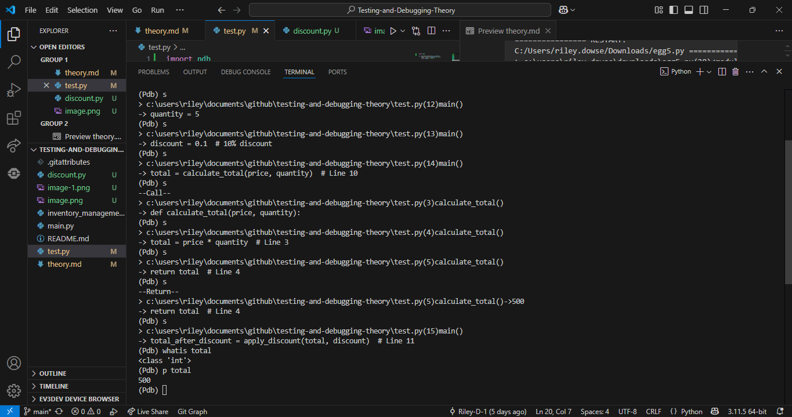
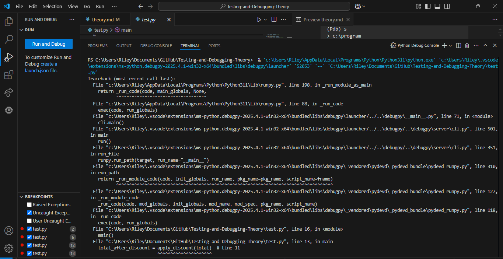
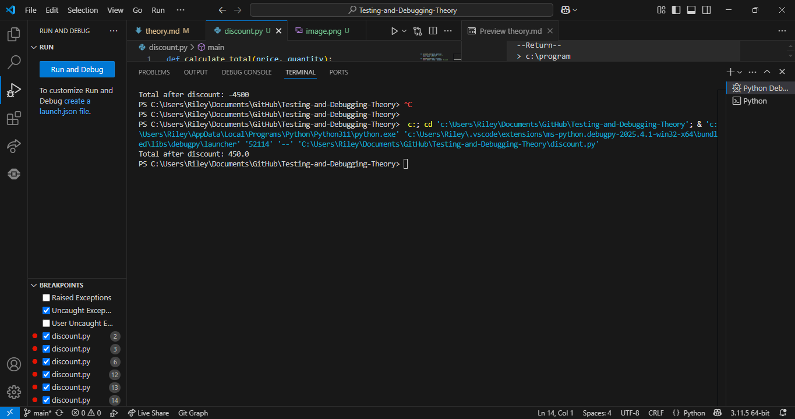

1. Boundary value testing is where errors at the end of the input range are tested. For example, if a program accepts numbers between 1 and 100, boundary value testing would check inputs like 1, 100, 0 , 101. Comparatively path coverage testing checks all of the possible paths in the software, ensuring all are used at least once. This allows you to confirm that the less commonly used paths are still properly functional. For example consider a program that checks someone's age, this type of testing would check every path to confirm their functionality. Lastly, Faulty and Abnormal data which is used to see how a program handles invalid inputs, this testing makes sure that typos or unexpected inputs font because the software crashes. For example, consider a calculator by testing the input with letters and symbols. We can adapt the program to respond to invalid results to users in a clearer way.


2.
``` python
def is_safe_temperature(temp):
    return 0 <= temp <= 100
print(is_safe_temperature(0))
print(is_safe_temperature(100))
print(is_safe_temperature(101))
print(is_safe_temperature(-1))
```
3.
``` python
def ticket_price(age):
    if age < 5:
        return "Free"
    elif 5 <= age <= 17:
        return "$5"
    elif 18 <= age <= 64:
        return "$10"
    else:
        return "Senior Discount - $7"
print(ticket_price(4))
print(ticket_price(13))
print(ticket_price(18))
print(ticket_price(65))
```
4.
```python
def divide_numbers(a, b):
    try:
        return a / b
    except ZeroDivisionError:
        return "Error: Cannot divide by zero"
    except TypeError:
        return "Error: Invalid input, numbers required"


print(divide_numbers(12, 2))
print(divide_numbers(6, 0))  
print(divide_numbers("10", 5))
```


Testing Debugging
1. Compare unit testing, integration testing and system testing.
Unit testing,integration testing and system testing differ and test different parts of the program making all of them important in the debugging stage. Unit testing is where each unit is individually tested. Integration testing involves combining some units together to test the program. System testing tests the entire system as a whole, ensuring everything works together as expected. The fact that each of the types test a different part of the software leads to a more thorough testing and debugging process.


Recognising errors
1. Syntax Error and Logical Error: The correct notation for multiplication is * instead of the x they used. It also is wrong because the correct math equation is A = π r². Squared in python is simply **.
``` python
def calculate_area(radius):
    area = 3.14 x radius x 2
    return area


print(calculate_area(5))
print(calculate_area(3))
```
2. Logical Error: The correct equation for finding error of a rectangle/square is length*width not length+width
``` python
def calculate_area(length, width):
    return length + width


area = calculate_area(5, 3)
print(f"Area: {area}")
```


3. Runtime error: Cannot divide by zero as it causes the program to crash.
```python
def divide(a, b):
    return a / b


result = divide(10, 0)
print(result)
```
4. Syntax Error: The for loop is missing a colon.
```python
for i in range(5)
    print(i)
```
5. Logical Error: The average is found by dividing by the length of numbers not minus.
```python
def calculate_average(numbers):
    total = sum(numbers)
    return total - len(numbers)


numbers = [10, 20, 30, 40]
average = calculate_average(numbers)
print(f"Average: {average}")
```
6. Syntax Error: Forgot to import the maths module containing the Pi function.
```python
def calculate_area(diameter):
    return math.pi * diameter ** 2


print(calculate_area(5))
```
## Python Debugger


### Breakpoint and Next (n)


It's finishing the code and then running a library.  It prints the total after discount  and then will continue to return the different python run code libraries.


```
    > c:\users\riley.dowse\downloads\egg2.py(20)<module>()
    -> main()
    (Pdb) n
    Total after discount: 450.0
    --Return--
    > c:\users\riley.dowse\downloads\egg2.py(20)<module>()->None
    -> main()
    (Pdb) n
    > c:\program files\python312\lib\idlelib\run.py(585)runcode()
    -> interruptible = False
    (Pdb) n
    > c:\program files\python312\lib\idlelib\run.py(608)runcode()
    -> flush_stdout()
    (Pdb) n
    --Return--
    > c:\program files\python312\lib\idlelib\run.py(608)runcode()->None
    -> flush_stdout()
    (Pdb) n
    > c:\program files\python312\lib\idlelib\run.py(166)main()
    -> rpc.response_queue.put((seq, ret))
    (Pdb) n
    > c:\program files\python312\lib\idlelib\run.py(149)main()
    -> while True:


    (Pdb) n
    > c:\program files\python312\lib\idlelib\run.py(150)main()
    -> try:
    (Pdb) n
    > c:\program files\python312\lib\idlelib\run.py(151)main()
    -> if exit_now:
    (Pdb) n
    > c:\program files\python312\lib\idlelib\run.py(157)main()
    -> try:
    (Pdb) n
    > c:\program files\python312\lib\idlelib\run.py(158)main()
    -> request = rpc.request_queue.get(block=True, timeout=0.05)
    (Pdb) n
    _queue.Empty
    > c:\program files\python312\lib\idlelib\run.py(158)main()
    -> request = rpc.request_queue.get(block=True, timeout=0.05)
    (Pdb) n
    > c:\program files\python312\lib\idlelib\run.py(159)main()
    -> except queue.Empty:
    (Pdb) n
    > c:\program files\python312\lib\idlelib\run.py(160)main()
    -> request = None
    (Pdb) n
    > c:\program files\python312\lib\idlelib\run.py(163)main()
    -> if request:
    (Pdb) n
    > c:\program files\python312\lib\idlelib\run.py(168)main()
    -> handle_tk_events()
    (Pdb) n
    > c:\program files\python312\lib\idlelib\run.py(149)main()
    -> while True:
    (Pdb) n
    > c:\program files\python312\lib\idlelib\run.py(150)main()
    -> try:
    (Pdb) n
    > c:\program files\python312\lib\idlelib\run.py(151)main()
    -> if exit_now:
    (Pdb) n
    > c:\program files\python312\lib\idlelib\run.py(157)main()
    -> try:
    (Pdb) n
    > c:\program files\python312\lib\idlelib\run.py(158)main()
    -> request = rpc.request_queue.get(block=True, timeout=0.05)
    (Pdb) n
    _queue.Empty
    > c:\program files\python312\lib\idlelib\run.py(158)main()
    -> request = rpc.request_queue.get(block=True, timeout=0.05)
    (Pdb) n
    > c:\program files\python312\lib\idlelib\run.py(159)main()
    -> except queue.Empty:
    (Pdb) n
    > c:\program files\python312\lib\idlelib\run.py(160)main()
    -> request = None
    (Pdb) n
    > c:\program files\python312\lib\idlelib\run.py(163)main()
    -> if request:
    (Pdb) n
    > c:\program files\python312\lib\idlelib\run.py(168)main()
    -> handle_tk_events()
    (Pdb) n
    > c:\program files\python312\lib\idlelib\run.py(149)main()
    -> while True:
    (Pdb) n
    > c:\program files\python312\lib\idlelib\run.py(150)main()
    -> try:
    (Pdb) n
    > c:\program files\python312\lib\idlelib\run.py(151)main()
    -> if exit_now:
    (Pdb) n
    > c:\program files\python312\lib\idlelib\run.py(157)main()
    -> try:
    (Pdb) n
    > c:\program files\python312\lib\idlelib\run.py(158)main()
    -> request = rpc.request_queue.get(block=True, timeout=0.05)
    (Pdb) n
    _queue.Empty
    > c:\program files\python312\lib\idlelib\run.py(158)main()
    -> request = rpc.request_queue.get(block=True, timeout=0.05)n
    (Pdb)
    > c:\program files\python312\lib\idlelib\run.py(159)main()
    -> except queue.Empty:
    (Pdb) n
    > c:\program files\python312\lib\idlelib\run.py(160)main()
    -> request = None
    (Pdb) n
    > c:\program files\python312\lib\idlelib\run.py(163)main()
    -> if request:
    (Pdb) n
    > c:\program files\python312\lib\idlelib\run.py(168)main()
    -> handle_tk_events()
    (Pdb) n
    > c:\program files\python312\lib\idlelib\run.py(149)main()
    -> while True:
    (Pdb) n
    > c:\program files\python312\lib\idlelib\run.py(150)main()
    -> try:
    (Pdb) n
    > c:\program files\python312\lib\idlelib\run.py(151)main()
    -> if exit_now:
    (Pdb) n
    > c:\program files\python312\lib\idlelib\run.py(157)main()
    -> try:
    (Pdb) n
    > c:\program files\python312\lib\idlelib\run.py(158)main()
    -> request = rpc.request_queue.get(block=True, timeout=0.05)
    (Pdb) n
    _queue.Empty
    > c:\program files\python312\lib\idlelib\run.py(158)main()
    -> request = rpc.request_queue.get(block=True, timeout=0.05)
    (Pdb) n
    > c:\program files\python312\lib\idlelib\run.py(159)main()
    -> except queue.Empty:
    (Pdb) n
    > c:\program files\python312\lib\idlelib\run.py(160)main()
    -> request = None
    (Pdb) n
    > c:\program files\python312\lib\idlelib\run.py(163)main()
    -> if request:
    (Pdb)
    > c:\program files\python312\lib\idlelib\run.py(168)main()
    -> handle_tk_events()
    (Pdb) n


```


### Single Line Stepping (s)
The program is running through It's finishing the code and then running a library.  It prints all of the different values and then will continue returning the different python run code libraries.
```
Python 3.12.8 (tags/v3.12.8:2dc476b, Dec  3 2024, 19:30:04) [MSC v.1942 64 bit (AMD64)] on win32
Type "help", "copyright", "credits" or "license()" for more information.


================ RESTART: C:/Users/riley.dowse/Downloads/egg5.py ===============
> c:\users\riley.dowse\downloads\egg5.py(20)<module>()
-> main()
(Pdb) s
--Call--
> c:\users\riley.dowse\downloads\egg5.py(10)main()
-> def main():
(Pdb) s
> c:\users\riley.dowse\downloads\egg5.py(11)main()
-> price = 100
(Pdb) s
> c:\users\riley.dowse\downloads\egg5.py(12)main()
-> quantity = 5
(Pdb) s
> c:\users\riley.dowse\downloads\egg5.py(13)main()
-> discount = 0.1  # 10% discount
(Pdb) s
> c:\users\riley.dowse\downloads\egg5.py(14)main()
-> total = calculate_total(price, quantity)  # Line 10
(Pdb) s
--Call--
> c:\users\riley.dowse\downloads\egg5.py(3)calculate_total()
-> def calculate_total(price, quantity):
(Pdb) s
> c:\users\riley.dowse\downloads\egg5.py(4)calculate_total()
-> total = price * quantity  # Line 3
(Pdb) s
> c:\users\riley.dowse\downloads\egg5.py(5)calculate_total()
-> return total  # Line 4
(Pdb) s
--Return--
> c:\users\riley.dowse\downloads\egg5.py(5)calculate_total()->500
-> return total  # Line 4
(Pdb) s
> c:\users\riley.dowse\downloads\egg5.py(15)main()
-> total_after_discount = apply_discount(total, discount)  # Line 11
(Pdb) s
--Call--
> c:\users\riley.dowse\downloads\egg5.py(7)apply_discount()
-> def apply_discount(total, discount):
(Pdb) s
> c:\users\riley.dowse\downloads\egg5.py(8)apply_discount()
-> return total - (total * discount)  # Line 6
(Pdb) s
--Return--
> c:\users\riley.dowse\downloads\egg5.py(8)apply_discount()->450.0
-> return total - (total * discount)  # Line 6
(Pdb) s
> c:\users\riley.dowse\downloads\egg5.py(16)main()
-> print(f"Total after discount: {total_after_discount}")  # Line 12
(Pdb) s
--Call--
> c:\program files\python312\lib\idlelib\run.py(467)write()
-> def write(self, s):
(Pdb) s
> c:\program files\python312\lib\idlelib\run.py(468)write()
-> if self.closed:
(Pdb) s
> c:\program files\python312\lib\idlelib\run.py(470)write()
-> s = str.encode(s, self.encoding, self.errors).decode(self.encoding, self.errors)
(Pdb) s
--Call--
> c:\program files\python312\lib\idlelib\run.py(446)encoding()
-> @property
(Pdb) s
> c:\program files\python312\lib\idlelib\run.py(448)encoding()
-> return self._encoding
(Pdb) s
--Return--
> c:\program files\python312\lib\idlelib\run.py(448)encoding()->'utf-8'
-> return self._encoding
(Pdb) s
--Call--
> c:\program files\python312\lib\idlelib\run.py(450)errors()
-> @property
(Pdb) s
> c:\program files\python312\lib\idlelib\run.py(452)errors()
-> return self._errors
(Pdb) s
--Return--
> c:\program files\python312\lib\idlelib\run.py(452)errors()->'surrogatepass'
-> return self._errors
(Pdb) s
--Call--
> c:\program files\python312\lib\idlelib\run.py(446)encoding()
-> @property
(Pdb) s
> c:\program files\python312\lib\idlelib\run.py(448)encoding()
-> return self._encoding
(Pdb) s
--Return--
> c:\program files\python312\lib\idlelib\run.py(448)encoding()->'utf-8'
-> return self._encoding
(Pdb) s
--Call--
> c:\program files\python312\lib\idlelib\run.py(450)errors()
-> @property
(Pdb) s
> c:\program files\python312\lib\idlelib\run.py(452)errors()
-> return self._errors
(Pdb) s
--Return--
> c:\program files\python312\lib\idlelib\run.py(452)errors()->'surrogatepass'
-> return self._errors
(Pdb) s
> c:\program files\python312\lib\idlelib\run.py(471)write()
-> return self.shell.write(s, self.tags)
(Pdb) s
--Call--
> c:\program files\python312\lib\idlelib\rpc.py(559)__getattr__()
-> def __getattr__(self, name):
(Pdb) s
> c:\program files\python312\lib\idlelib\rpc.py(560)__getattr__()
-> if self.__methods is None:
(Pdb) s


```


### Compare the next (n) command with the step (s) command.


The next command is less specialised and more of an overview compared to Step and continues to the next line. Step is the more specialized closer look at your python code and it stops at the first possible occasion.  The main difference between the two is that Step will stop in every called function whereas Next goes through the entire called function and only stops at the next line in the current function/loop.
### Watch, what is and print (p)
The program first iterates line by line using the step command and shows each step of the program. The program then displays the type that total is when I type the what is command. The program then shows that it is an integer type. Then the command p prints total's value to the console.

VS CODE DEBUGGER
Before fix



After Fix

Code after fix
```python
def calculate_total(price, quantity):
    total = price * quantity  # Line 3
    return total  # Line 4


def apply_discount(total, discount):
    return total - (total * discount)  # Line 6


def main():
    price = 100
    quantity = 5
    discount = .10 #
    total = calculate_total(price, quantity)  # Line 10
    total_after_discount = apply_discount(total,discount)  # Line 11
    print(f"Total after discount: {total_after_discount}")  # Line 12


main()
```


